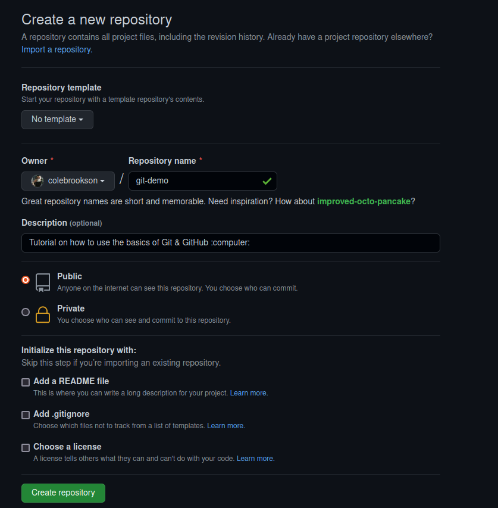

# Git/GitHub Crash Course for Biologists

This is a quick tutorial I have written for my colleagues in the biological sciences. This tutorial, given live, can be completed in ~1hr if all participants have done the required prep work. The goal of this is not to teach the theory behind version control, nor to delve deeply into the details of `git`/GitHub, but to give you a digestible introduction to how to implement repositories into your workflow. 

**Required Background:** This workshop technically does not need any previous experience with `git` or GitHub, but will be most useful if you are a bit familiar with both. 

## Pre-Workshop Prep 

To get set up for this live session you will need a few key items: 

1. A GitHub account with an SSH key set up for the computer you will be using for this tutorial 

* Sign up for a [GitHub account here](https://github.com/join). It will only take a few minutes!
* Add an SSH key for your account
  * First [check for an existing key](https://docs.github.com/en/authentication/connecting-to-github-with-ssh/checking-for-existing-ssh-keys) 
  * If you don't have one, [generate an ssh key](https://docs.github.com/en/authentication/connecting-to-github-with-ssh/generating-a-new-ssh-key-and-adding-it-to-the-ssh-agent) according to the instructions specific to your operating system 
  * You will then need to [add the ssh key to your GitHub account](https://docs.github.com/en/authentication/connecting-to-github-with-ssh/adding-a-new-ssh-key-to-your-github-account)
  * You can [test the connection](https://docs.github.com/en/authentication/connecting-to-github-with-ssh/testing-your-ssh-connection) to make sure it works before continuing 
  
2. A way to interact with `git` via the command line. This can be done in a few ways<sup>1</sup>:

* If you are a Mac user, you can use the `Terminal` app which will be already installed in your computer
  * This will still require `git` to be installed through [one of these options](https://git-scm.com/download/mac) (I recommend the `homebrew` option)
* If you are a PC user, I recommend [installing Git Bash](https://git-scm.com/)
* In Linux just use the `Terminal`

3. A reasonably fast internet connection 

## How to use the tools

Okay, now that we're set up, let's talk a bit about the tools we're actually using before we go any further. Here is a quick presentation on version control, and Git/GitHub, that will appropriately set the scene. 

## Let's get our hands dirty 

With this knowledge of the theory under our belts, let's dive in. Start by opening up a browser, and navigating to your GitHub account. Also, open up a terminal, and navigate to the location you want to host this repository in. I personally recommend having a "github" folder in the root of your file system, for ease of use and access. 

```
cd ~/github
```

### Make a new repo

Let's first make a new repository: 



Once the repo has been created we will see this: 


Now this is an empty repository (which is fine). Since we've set up our SSH key's already, let's go ahead and copy that address given here and clone it using the following command, and once that repo has been created,`cd` into that new repo.  

```
git clone git@github.com:colebrookson/git-demo.git
cd git-demo 
```
# make a new file 
```
mkdir data
mkdir src
cd data
touch data.csv
nano data.csv
```
# instide the data.csv file put:
```
col1,col2,col3
1,2,3
4,5,6
```
```
cd .. 
cd src
touch analysis.R
nano analysis.R
```
# inside the analysis.R put:
```
data = read.csv("~/github-demos/git-demo/data/data.csv")
print(data$col2) #should print 2 5 
```
```
Rscript analysis.R
cd ..
```
# back in root of repo 
```
git add .
git commit -m "added data files and an analysis file"
```

# now, change the analysis file 
```
cd src 
nano analysis.R
# change the column to the third column
```
# now commit these new changes
```
git add .
git commit -m "changes to analysis script"
git push
```
# now the goal is to revert back to the previous version of the file 

Say something about how you can navigate back in the file structure and see the old versions of the files and double check things, but you can also just revert to that commit 
```
cd data
nano data.csv
# change the first item just so there's something different 
git add .
git commit -m "change data"
git push
```
Let's say we don't want any of our changes since then
```
git log # here you can see all your previous commits
q # to exit the log
git revert --no-commit 9b1ba3b6a289d047f5b024f956a7d3bcb2d0444d..HEAD # the commit number has to change 
git commit -m "reverted because I didn't want the data or analysis to change like that"
```
But what if we DO want to keep some of the changes we made since then? 
```
# make changes to data.csv and analysis.R again 
git checkout -b old-state 10829683322b6e39fabad6c131603f55e0ad3693 # change the commit number 
git status
git branch 
# make changes to the analysis.R script 
git status
git add .
git commit -m "put analysis.R back to how I wanted it"
git push --set-upstream origin out-state
git checkout main
git merge out-state
# show how we did the thing can be proved now
Rscript src/analysis.R
```


## Notes

1. You'll notice here I don't recommend using `git` through RStudio or any GUI (graphical user interface) options such as GitHub Desktop. While those are valid options, I do not think they are optimal for learning git nor for actually using it. I will speak briefly further on this during the session. You can still use a GUI option or one other than the options above if you would like, but I cannot guarantee the process will transfer well between the programs during the live session. 
